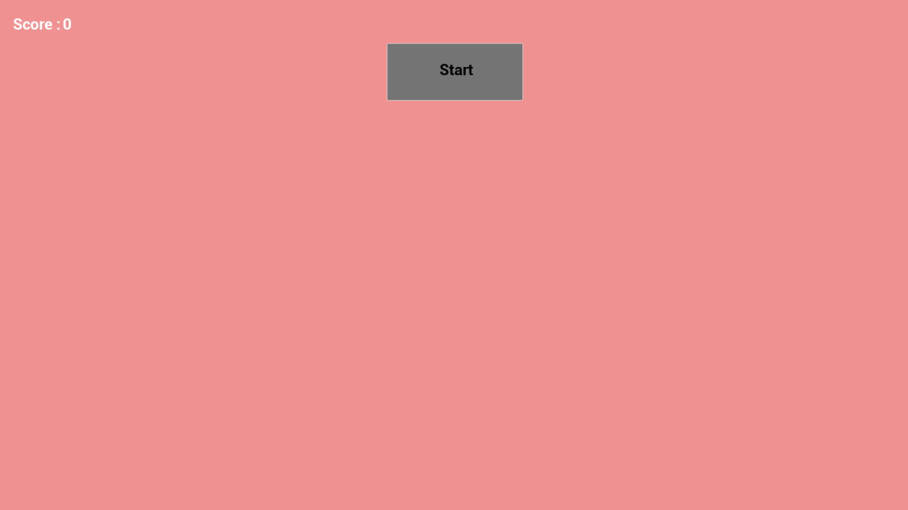
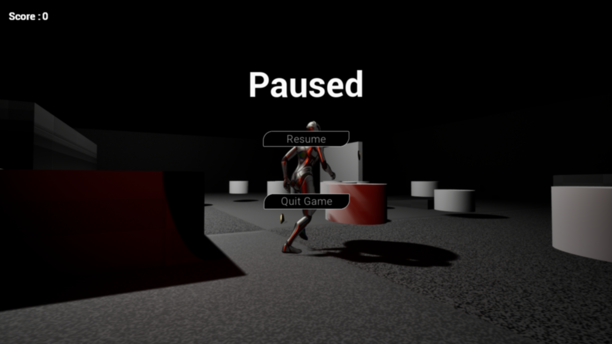
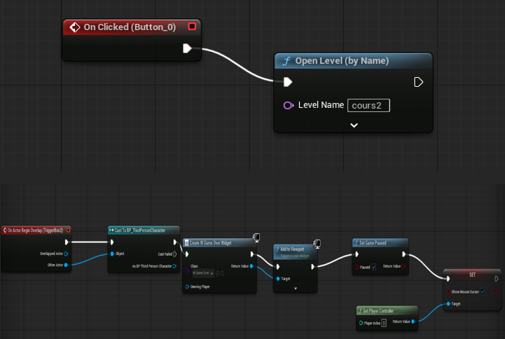
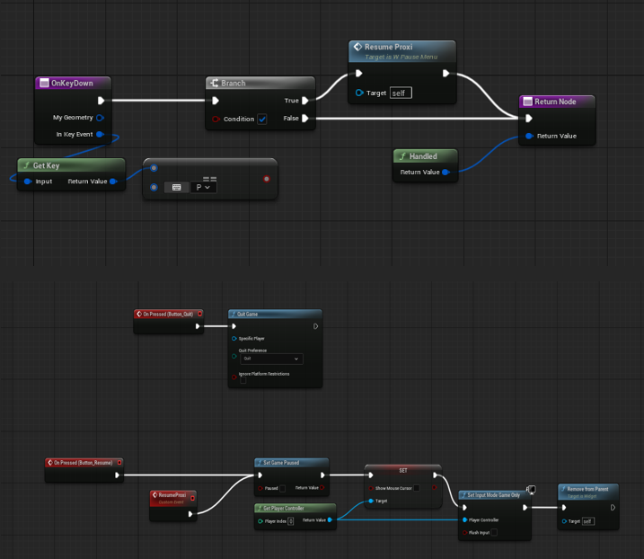
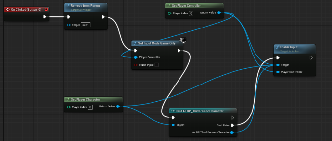
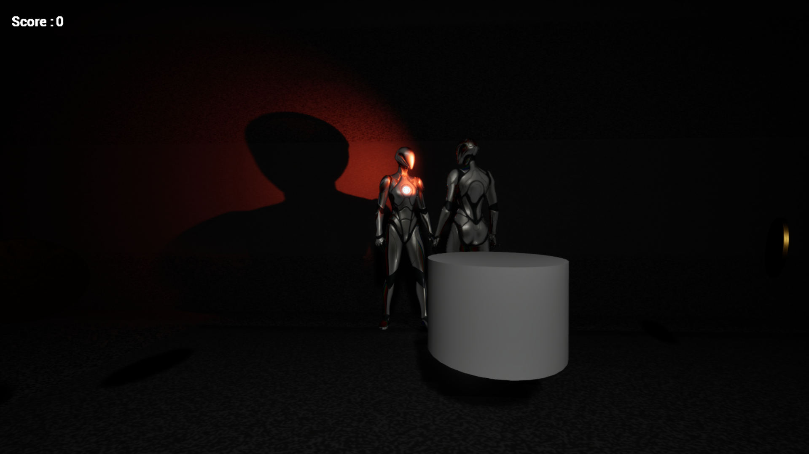
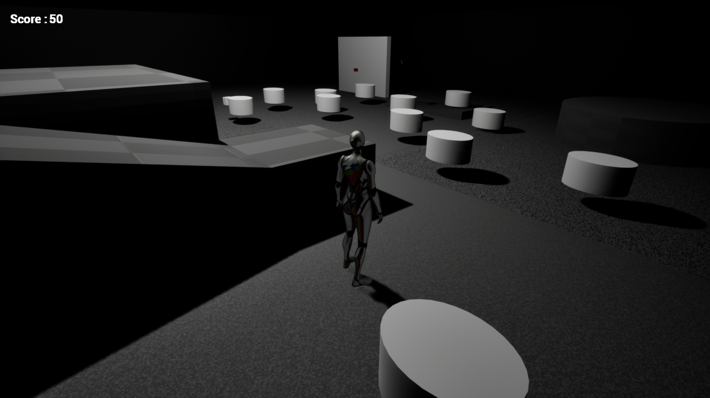
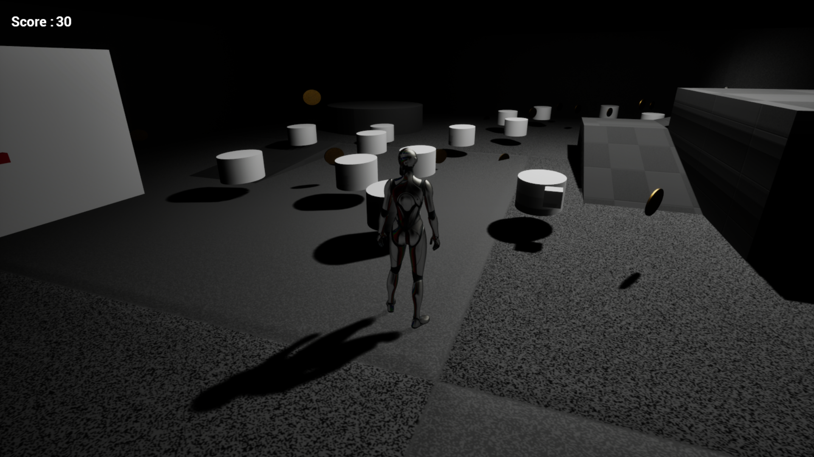
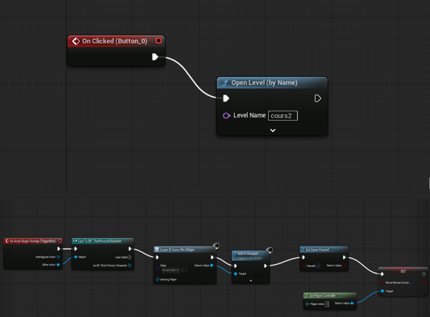

# UE5 Coin Collector AI Game

## Description

Jeu développé avec Unreal Engine 5 en utilisant le système Blueprints.
Le joueur doit collecter un maximum de pièces tout en évitant un ennemi contrôlé par une intelligence artificielle qui le poursuit.
Le projet inclut un score dynamique, un système de menus complet et une interface utilisateur interactive.

## Fonctionnalités principales

- Collecte de pièces
- Score en temps réel
- Ennemi avec IA poursuivant le joueur
- Menu principal
- Menu pause
- Reprise via clavier ou boutons
- Chargement de niveau
- Gestion des entrées joueur
- Interface utilisateur (HUD)

## Technologies utilisées

- Unreal Engine 5
- Blueprints
- IA (Enemy AI)
- UI / HUD System

## Captures d’écran

### Menu principal

### Menu pause

### Chargement de niveau

### Reprise via clavier

### Reprise / Quitter

### IA ennemie

### Interface score

### Scène du jeu

### Restauration des contrôles

## Gameplay Video

Démonstration du gameplay du jeu : collecte de pièces, IA ennemie poursuivant le joueur, système de score et menus.

 
## Auteur

Omar Akhachane  
Étudiant en programmation de jeux vidéo  
Collège LaSalle
